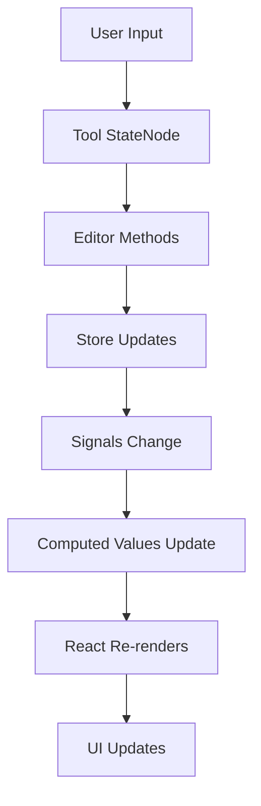

The tldraw SDK is built around reactive state management and a modular architecture that separates concerns while maintaining excellent performance. This page explains the core architectural patterns that power the SDK.

## Core packages

The tldraw SDK is organized as a monorepo with specialized packages that work together:

### @tldraw/editor

The foundational infinite canvas editor engine with no UI, shapes, or tools included.

```typescript
import { Editor } from '@tldraw/editor'

const editor = new Editor({
  store,
  shapeUtils: [],
  bindingUtils: [],
  tools: [],
  getContainer: () => document.body,
})
```

**Key features:**
- Reactive state management using `@tldraw/state` signals
- Shape system via `ShapeUtil` classes
- Tool system via `StateNode` hierarchies
- Bindings system for shape relationships
- No opinions about UI or default shapes

### @tldraw/tldraw

The complete "batteries included" SDK that builds on `@tldraw/editor`.

```tsx
import { Tldraw } from 'tldraw'
import 'tldraw/tldraw.css'

export default function App() {
  return <Tldraw />
}
```

**Includes:**
- Full UI with toolbar, menus, and panels
- Default shape utilities (text, draw, geo, arrow, etc.)
- Complete tool set (select, hand, eraser, etc.)
- Responsive UI system with customizable components

### @tldraw/store

A reactive client-side database for managing records.

**Features:**
- Document persistence with IndexedDB
- Reactive updates using signals from `@tldraw/state`
- Migration system for schema changes
- Automatic change tracking and history

### @tldraw/state

The reactive signals library that powers all state management in tldraw.

```typescript
import { atom, computed, react } from '@tldraw/state'

const count = atom('count', 0)
const doubled = computed('doubled', () => count.get() * 2)

react('log doubled', () => {
  console.log('Doubled:', doubled.get())
})

count.set(5) // Logs: "Doubled: 10"
```

See [State management](/advanced/state-management) for details.

### @tldraw/tlschema

Type definitions, validators, and migrations for shapes, bindings, and records.

**Provides:**
- Shape and binding type definitions
- Validation schemas using `@tldraw/validate`
- Migration sequences for schema evolution
- Shared data structures

## Architectural patterns

### Reactive state management

All editor state is reactive and observable using the signals pattern from `@tldraw/state`.

```typescript
import { Editor } from '@tldraw/editor'

const editor = new Editor(options)

// Selected shapes is a computed signal
const selectedShapes = editor.getSelectedShapes()

// Automatically re-runs when selection changes
editor.sideEffects.registerAfterChangeHandler('instance', (prev, next) => {
  console.log('Selection changed')
})
```

**Benefits:**
- Automatic dependency tracking prevents unnecessary re-renders
- Lazy evaluation improves performance
- Predictable update patterns
- Easy to test and debug

<Tip>
The editor batches updates automatically, ensuring optimal performance while maintaining reactive state consistency.
</Tip>

### Shape system

Each shape type has a `ShapeUtil` class that defines its behavior:

```typescript
import { ShapeUtil, TLBaseShape } from '@tldraw/editor'

type MyShape = TLBaseShape<'my-shape', { width: number; height: number }>

class MyShapeUtil extends ShapeUtil<MyShape> {
  static override type = 'my-shape'
  
  // Define geometry for hit testing
  getGeometry(shape: MyShape) {
    return new Rectangle2d({
      width: shape.props.width,
      height: shape.props.height,
      isFilled: true,
    })
  }
  
  // Render the shape
  component(shape: MyShape) {
    return <div style={{ width: shape.props.width, height: shape.props.height }} />
  }
  
  // Render selection indicator
  indicator(shape: MyShape) {
    return <rect width={shape.props.width} height={shape.props.height} />
  }
}
```

**ShapeUtil responsibilities:**
- **Geometry:** Hit testing, bounds calculation, collision detection
- **Rendering:** Component and indicator visualization
- **Interactions:** Resizing, rotating, editing behavior
- **Serialization:** Export to SVG, JSON, or other formats

### Tools as state machines

Tools are implemented as `StateNode` hierarchies with event-driven behavior:

```typescript
import { StateNode } from '@tldraw/editor'

class MyTool extends StateNode {
  static override id = 'my-tool'
  
  override onEnter() {
    this.editor.setCursor({ type: 'cross' })
  }
  
  override onPointerDown(info: TLPointerEventInfo) {
    const { currentPagePoint } = info
    
    this.editor.createShape({
      type: 'my-shape',
      x: currentPagePoint.x,
      y: currentPagePoint.y,
      props: { width: 100, height: 100 },
    })
  }
}
```

**State machine features:**
- Event handlers for pointer, keyboard, and tick events
- Child states for complex tools (e.g., SelectTool has Brushing, Translating, etc.)
- Automatic state transitions based on user input
- Clean separation of tool logic

<Accordion title="Example: Complex tool with child states">
```typescript
class SelectTool extends StateNode {
  static override id = 'select'
  static override children = () => [
    Idle,
    Brushing,
    Translating,
    Rotating,
    Resizing,
  ]
  
  override onPointerDown(info: TLPointerEventInfo) {
    if (info.shiftKey) {
      this.transition('brushing')
    }
  }
}

class Brushing extends StateNode {
  static override id = 'brushing'
  
  override onPointerMove() {
    // Update brush selection
  }
  
  override onPointerUp() {
    this.transition('idle', { historyMark: true })
  }
}
```
</Accordion>

### Bindings system

Bindings create relationships between shapes (like arrows connected to shapes):

```typescript
import { BindingUtil } from '@tldraw/editor'

type MyBinding = TLBinding<'my-binding', { strength: number }>

class MyBindingUtil extends BindingUtil<MyBinding> {
  static override type = 'my-binding'
  
  // Called when bound shapes change
  override onAfterChangeToShape({ binding, shapeAfter }: BindingOnShapeChangeOptions<MyBinding>) {
    const { fromId, toId } = binding
    
    // Update connected shapes
    if (shapeAfter.id === fromId) {
      this.editor.updateShape({
        id: toId,
        // Update based on binding logic
      })
    }
  }
}
```

**Binding features:**
- Automatic updates when connected shapes change
- Cleanup on shape deletion
- Type-safe binding definitions
- Support for one-to-many and many-to-many relationships

## Data flow

The tldraw architecture follows a unidirectional data flow:



1. **User input** triggers tool event handlers
2. **Tools** call editor methods to modify state
3. **Editor** updates the store (shapes, bindings, etc.)
4. **Store changes** propagate through signals
5. **Computed values** update lazily when accessed
6. **React components** re-render based on changed signals
7. **UI updates** reflect the new state

<Warning>
Never mutate shapes or records directly. Always use editor methods like `editor.updateShape()` to ensure proper reactivity and history tracking.
</Warning>

## Performance optimizations

The architecture includes several performance optimizations:

### Lazy evaluation

Computed signals only recalculate when accessed and dependencies have changed:

```typescript
const selectedShapeIds = computed('selectedShapeIds', () => {
  return editor.getCurrentPageShapeIds().filter(id => {
    return editor.getSelectedShapeIds().includes(id)
  })
})

// Only computes when accessed AND dependencies changed
const ids = selectedShapeIds.get()
```

### Automatic culling

Shapes outside the viewport are automatically culled from rendering:

```typescript
class MyShapeUtil extends ShapeUtil<MyShape> {
  // Control culling behavior for shapes with overflow effects
  override canCull(shape: MyShape) {
    return !shape.props.hasGlow // Don't cull shapes with glow
  }
}
```

### Batched updates

Multiple changes within a single transaction are batched:

```typescript
import { transact } from '@tldraw/state'

// All updates batched into single re-render
transact(() => {
  editor.updateShape({ id: shape1.id, x: 100 })
  editor.updateShape({ id: shape2.id, y: 200 })
  editor.updateShape({ id: shape3.id, rotation: Math.PI })
})
```

## Next steps

<CardGroup cols={2}>
  <Card title="State management" icon="atom" href="/advanced/state-management">
    Deep dive into reactive signals with @tldraw/state
  </Card>
  <Card title="Performance" icon="gauge-high" href="/advanced/performance">
    Learn performance optimization techniques
  </Card>
  <Card title="Custom shapes" icon="shapes" href="/shapes/custom-shapes">
    Build custom shape utilities
  </Card>
  <Card title="Custom tools" icon="wrench" href="/tools/custom-tools">
    Create custom tool state machines
  </Card>
</CardGroup>