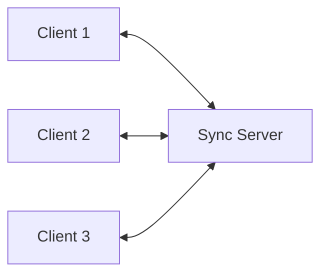

Tldraw includes a multiplayer synchronization SDK (`@tldraw/sync`) that enables real-time collaboration between users.

## Basic setup with useSyncDemo

For development and testing, you can use the `useSyncDemo` hook:

```tsx SyncDemoExample.tsx
import { useSyncDemo } from '@tldraw/sync'
import { Tldraw } from 'tldraw'
import 'tldraw/tldraw.css'

export default function SyncDemoExample({ roomId }: { roomId: string }) {
  const store = useSyncDemo({ roomId })
  return (
    <div className="tldraw__editor">
      <Tldraw store={store} options={{ deepLinks: true }} />
    </div>
  )
}
```

<Warning>
The `useSyncDemo` hook is for development only. For production, you need to set up a sync server.
</Warning>

## How multiplayer works

Tldraw's multiplayer system uses a client-server architecture:

1. **Client**: The tldraw editor in the browser
2. **Sync server**: Handles real-time synchronization between clients
3. **Store**: The shared data store that syncs across all clients



## Setting up a sync server

For production, you'll need to deploy your own sync server. The tldraw repository includes a reference implementation.

### 1. Install dependencies

```bash
npm install @tldraw/sync @tldraw/store
```

### 2. Create a sync worker

The sync server can be deployed as a Cloudflare Durable Object, a WebSocket server, or other real-time infrastructure.

See the `apps/dotcom/sync-worker` directory in the tldraw repository for a complete implementation.

## Custom presence

You can add custom user presence information:

```tsx
import { Tldraw, createPresenceStateDerivation, track, useEditor } from 'tldraw'
import { useSyncDemo } from '@tldraw/sync'

interface CustomUserPresence {
  id: string
  name: string
  color: string
  cursor: { x: number; y: number }
}

export default function CustomPresenceExample({ roomId }: { roomId: string }) {
  const store = useSyncDemo({ roomId })

  return (
    <div className="tldraw__editor">
      <Tldraw
        store={store}
        onMount={(editor) => {
          // Set user name and color
          editor.user.updateUserPreferences({
            name: 'Alice',
            color: '#ff0000',
          })
        }}
      />
    </div>
  )
}
```

## Room management

### Creating rooms

Each collaboration session is identified by a unique `roomId`:

```tsx
const roomId = `room-${generateUniqueId()}`
const store = useSyncDemo({ roomId })
```

### Multiple users

Multiple users can join the same room by using the same `roomId`:

```tsx
// User 1
const store1 = useSyncDemo({ roomId: 'shared-room-123' })

// User 2 (different browser/device)
const store2 = useSyncDemo({ roomId: 'shared-room-123' })
```

## Showing collaborators

Tldraw automatically shows collaborator cursors and selections when using a sync store. You can customize the appearance:

```tsx
import { Tldraw, track, useEditor } from 'tldraw'

const CollaboratorsList = track(() => {
  const editor = useEditor()
  const collaborators = editor.getCollaborators()

  return (
    <div style={{ position: 'absolute', top: 10, right: 10 }}>
      <h3>Online users ({collaborators.length})</h3>
      <ul>
        {collaborators.map(user => (
          <li key={user.userId} style={{ color: user.color }}>
            {user.userName}
          </li>
        ))}
      </ul>
    </div>
  )
})

export default function Example({ roomId }: { roomId: string }) {
  const store = useSyncDemo({ roomId })

  return (
    <div className="tldraw__editor">
      <Tldraw store={store}>
        <CollaboratorsList />
      </Tldraw>
    </div>
  )
}
```

## Private content

You can mark certain shapes as private so they don't sync to other users:

```tsx
editor.createShape({
  type: 'text',
  x: 100,
  y: 100,
  meta: {
    private: true,
  },
})
```

Then filter private shapes during sync:

```tsx
const store = useSyncDemo({
  roomId,
  // Only sync non-private shapes
  shouldSync: (record) => {
    if (record.typeName === 'shape') {
      return !record.meta?.private
    }
    return true
  },
})
```

## Conflict resolution

Tldraw uses a last-write-wins strategy for conflict resolution. Changes are timestamped and the most recent change takes precedence.

For custom conflict resolution, you can:

1. Listen to sync events
2. Detect conflicts in your application logic
3. Apply custom merge strategies

## Performance considerations

<CardGroup cols={2}>

<Card title="Optimize updates" icon="gauge-high">
Batch multiple changes into a single transaction using `editor.batch()`
</Card>

<Card title="Limit room size" icon="users">
For best performance, limit rooms to 50-100 concurrent users
</Card>

<Card title="Use compression" icon="file-zipper">
Enable WebSocket compression on your sync server
</Card>

<Card title="Regional servers" icon="earth-americas">
Deploy sync servers close to your users for lower latency
</Card>

</CardGroup>

## Deep links

Enable deep links to allow sharing specific views:

```tsx
<Tldraw
  store={store}
  options={{ deepLinks: true }}
/>
```

This enables URL-based camera positioning and selection sharing.

## Related

- [Persistence](/examples/persistence) - Save and load editor state
- [Custom presence example](https://github.com/tldraw/tldraw/tree/main/apps/examples/src/examples/collaboration/sync-custom-presence)
- [Sync server reference](https://github.com/tldraw/tldraw/tree/main/apps/dotcom/sync-worker)