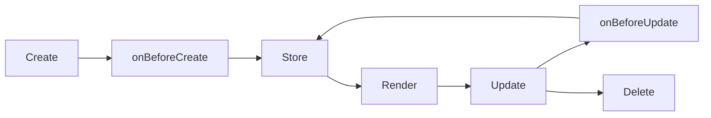

The tldraw shape system provides a flexible, type-safe architecture for creating custom shapes with full control over geometry, rendering, and interactions. Every shape in tldraw is powered by a **ShapeUtil** class that defines its behavior.

## Core concepts

The shape system is built on three foundational concepts:

<CardGroup cols={3}>
  <Card title="Shape data" icon="database">
    Type-safe shape records stored in the editor's reactive store
  </Card>
  <Card title="ShapeUtil classes" icon="code">
    Define how shapes behave, render, and respond to interactions
  </Card>
  <Card title="Geometry primitives" icon="shapes">
    Mathematical representations for hit testing and bounds calculation
  </Card>
</CardGroup>

## Shape anatomy

Every shape in tldraw consists of:

### Shape record

A shape record is stored in the editor's store and contains:

```typescript
type TLShape = {
  id: TLShapeId
  type: string
  x: number
  y: number
  rotation: number
  index: IndexKey
  parentId: TLParentId
  props: ShapeProps  // Type-specific properties
  meta: object       // User-defined metadata
  opacity: number
  isLocked: boolean
}
```

### ShapeUtil class

A ShapeUtil defines the shape's behavior and appearance:

```typescript
import { ShapeUtil, TLBaseShape, Rectangle2d } from 'tldraw'

type MyShape = TLBaseShape<'myShape', {
  w: number
  h: number
  color: string
}>

class MyShapeUtil extends ShapeUtil<MyShape> {
  static override type = 'myShape' as const
  
  getDefaultProps(): MyShape['props'] {
    return { w: 100, h: 100, color: 'black' }
  }
  
  getGeometry(shape: MyShape) {
    return new Rectangle2d({
      width: shape.props.w,
      height: shape.props.h,
      isFilled: true,
      isClosed: true,
    })
  }
  
  component(shape: MyShape) {
    return <div style={{ width: shape.props.w, height: shape.props.h }} />
  }
  
  indicator(shape: MyShape) {
    return <rect width={shape.props.w} height={shape.props.h} />
  }
}
```

## Built-in shapes

The `@tldraw/tldraw` package includes these shape implementations:

<AccordionGroup>
  <Accordion title="Basic shapes">
    - **Geo** - Rectangles, ellipses, triangles, stars, and more geometric primitives
    - **Text** - Auto-sizing or fixed-width text with rich formatting
    - **Draw** - Freehand drawing with pen pressure support
    - **Line** - Straight lines with optional arrowheads
  </Accordion>
  
  <Accordion title="Advanced shapes">
    - **Arrow** - Smart arrows with binding, labels, and multiple routing types (straight, arc, elbow)
    - **Note** - Sticky notes with auto-growing text
    - **Highlight** - Highlighter pen for annotations
  </Accordion>
  
  <Accordion title="Container shapes">
    - **Frame** - Frames for grouping and clipping child shapes
    - **Group** - Logical grouping without visual container
  </Accordion>
  
  <Accordion title="Media shapes">
    - **Image** - Raster images with optional cropping
    - **Video** - Embedded video players
    - **Embed** - iFrame embeds for external content
    - **Bookmark** - Link preview cards
  </Accordion>
</AccordionGroup>

## Shape lifecycle

Shapes go through a predictable lifecycle:



### Lifecycle hooks

ShapeUtil provides hooks to intercept shape changes:

<CodeGroup>
```typescript Creation
onBeforeCreate(next: Shape): Shape | void {
  // Validate or modify the shape before it's created
  return { ...next, props: { ...next.props, validated: true } }
}
```

```typescript Updates
onBeforeUpdate(prev: Shape, next: Shape): Shape | void {
  // React to property changes
  if (prev.props.text !== next.props.text) {
    return { ...next, props: { ...next.props, textChanged: true } }
  }
}
```
</CodeGroup>

## Shape validation

Shapes define their props schema using validators:

```typescript
import { T, ShapeUtil } from 'tldraw'

class MyShapeUtil extends ShapeUtil<MyShape> {
  static props = {
    w: T.number,
    h: T.number,
    color: T.string,
    // Style props are remembered across shapes
    fill: DefaultFillStyle,
  }
}
```

Validators ensure:
- Type safety at runtime
- Automatic validation on create/update
- Style prop persistence across shape creation

## Shape migrations

When shape props change between versions, migrations handle data transformation:

```typescript
class MyShapeUtil extends ShapeUtil<MyShape> {
  static migrations = defineMigrations({
    currentVersion: 1,
    migrators: {
      1: {
        up: (shape) => {
          // Migrate from v0 to v1
          return { ...shape, props: { ...shape.props, newProp: 'default' } }
        },
        down: (shape) => {
          // Rollback from v1 to v0
          const { newProp, ...rest } = shape.props
          return { ...shape, props: rest }
        },
      },
    },
  })
}
```

<Note>
  Migrations run automatically when loading documents created with older versions of your shape.
</Note>

## Registering custom shapes

To use custom shapes, register them with the editor:

```typescript
import { Tldraw } from 'tldraw'
import { MyShapeUtil } from './MyShapeUtil'

const shapeUtils = [MyShapeUtil]

export default function App() {
  return <Tldraw shapeUtils={shapeUtils} />
}
```

## Next steps

<CardGroup cols={2}>
  <Card title="ShapeUtil API" icon="code" href="/shapes/shape-utils">
    Learn about ShapeUtil methods and lifecycle hooks
  </Card>
  <Card title="Geometry system" icon="shapes" href="/shapes/geometry">
    Understand how shapes define their geometry
  </Card>
  <Card title="Rendering" icon="palette" href="/shapes/rendering">
    Control how shapes appear on the canvas
  </Card>
  <Card title="Interactions" icon="hand-pointer" href="/shapes/interactions">
    Handle user interactions and events
  </Card>
</CardGroup>